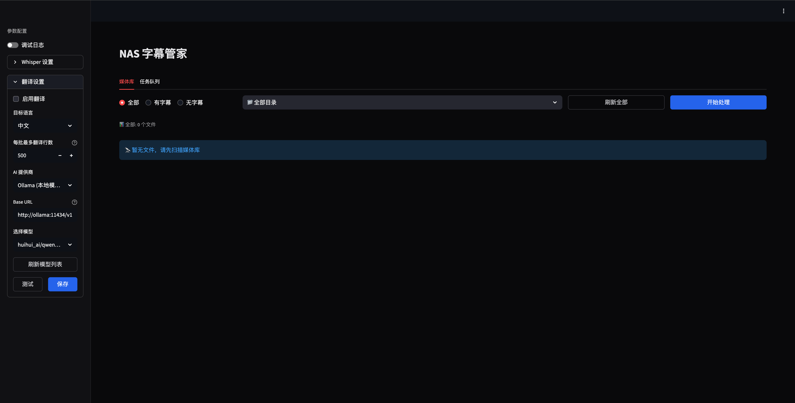

# NAS Subtitle Manager

> 自动化视频字幕提取与翻译的 NAS 管理工具

一个基于 Whisper + LLM 的智能字幕管理系统，自动扫描 NAS 媒体库，提取音轨生成字幕，并支持多语言翻译。适合家庭 NAS 环境的轻量级部署。

## ✨ 核心特性

- **🎯 自动化流程** - 扫描媒体库 → 提取字幕 → AI 翻译，全程自动化
- **🌐 多语言支持** - Whisper 支持 99+ 语言识别，LLM 翻译支持中英日韩等主流语言
- **🎨 暗色主题 UI** - 现代化 Web 界面，适配暗色环境
- **🔌 多 AI 提供商** - 支持 Ollama (本地)、DeepSeek、Gemini、OpenAI 等
- **📦 一键部署** - Docker Compose 部署，无需复杂配置
- **📊 任务队列** - 后台异步处理，实时进度监控

## 📸 截图预览

```

```

## 🚀 快速开始

### 前置要求

- Docker & Docker Compose
- NAS 或 Linux 服务器
- （可选）NVIDIA GPU + nvidia-docker（用于加速 Whisper）

### 一键部署

```bash
# 克隆仓库
git clone https://github.com/your-username/nas-subtitle-manager.git
cd nas-subtitle-manager

# 配置媒体路径
# 编辑 docker-compose.yml，修改 volumes 映射
# - /your/media/path:/media  # 你的媒体库路径

# 启动服务
docker-compose up -d

# 访问 Web 界面
open http://localhost:8501
```

### 目录结构

```
nas-subtitle-manager/
├── app.py                 # 主应用程序
├── docker-compose.yml     # Docker 编排配置
├── Dockerfile            # 容器构建文件
├── requirements.txt      # Python 依赖
└── README.md
```

## 📖 使用指南

### 1. 配置 Whisper 模型

**侧边栏 → Whisper 设置**

- **模型大小**: `tiny` (最快) → `large-v3` (最准确)
- **计算类型**: `int8` (省内存) / `float16` (更精确)
- **设备**: `cpu` / `cuda` (需 GPU)
- **视频原声**: 自动检测或指定语言

### 2. 配置翻译服务

**侧边栏 → 翻译设置**

#### 选项 A: Ollama 本地模型（推荐）

```bash
# 安装 Ollama
curl -fsSL https://ollama.com/install.sh | sh

# 拉取模型
ollama pull qwen2.5:7b
# 或其他模型: llama3.1, mistral, gemma2 等
```

配置：
- **AI 提供商**: Ollama (本地模型)
- **Base URL**: `http://ollama:11434/v1`
- **模型**: 从列表中选择已安装的模型

#### 选项 B: 云服务 API

支持的提供商：
- **DeepSeek** (国内推荐，性价比高)
- **Google Gemini** (速度快，免费额度)
- **Moonshot Kimi** (长文本优化)
- **阿里通义千问** / **智谱 GLM**
- **OpenAI** (需科学上网)

配置示例：
```
AI 提供商: DeepSeek (深度求索)
Base URL: https://api.deepseek.com
API Key: sk-xxxxxxxxxxxxx
模型: deepseek-chat
```

### 3. 扫描与处理

1. **刷新媒体库** - 扫描 `/media` 目录下的所有视频
2. **筛选文件** - 全部 / 有字幕 / 无字幕
3. **选择文件** - 勾选需要处理的视频
4. **开始处理** - 自动排队处理

### 4. 监控任务

**任务队列** 标签页实时显示：
- 🔵 等待中 - 队列中待处理
- 🟡 处理中 - Whisper 提取或 LLM 翻译中
- 🟢 完成 - 字幕已生成
- 🔴 失败 - 可重试或查看错误日志

## 🛠️ 高级配置

### 自定义媒体路径

编辑 `docker-compose.yml`:

```yaml
services:
  app:
    volumes:
      - /path/to/your/movies:/media        # 媒体库
      - /path/to/your/tv-shows:/media/tv   # 可挂载多个目录
      - ./data:/data                       # 数据持久化
```

### GPU 加速

```yaml
services:
  app:
    deploy:
      resources:
        reservations:
          devices:
            - driver: nvidia
              count: 1
              capabilities: [gpu]
```

### 字幕命名规范

自动识别以下格式：

```
movie.srt              → 默认字幕（内容检测语言）
movie.en.srt           → 英语字幕
movie.zh.srt           → 中文字幕
movie.ja.srt           → 日语字幕
movie.chs.srt          → 简体中文
movie.cht.srt          → 繁体中文
```

## 🔧 技术栈

- **后端**: Python 3.11 + Streamlit
- **字幕提取**: [Faster-Whisper](https://github.com/SYSTRAN/faster-whisper) (OpenAI Whisper 的 CTranslate2 优化版)
- **翻译引擎**: OpenAI-compatible API (支持多种 LLM)
- **数据库**: SQLite3 (轻量级，无需额外部署)
- **容器化**: Docker + Docker Compose

## 📊 性能参考

### Whisper 模型对比

| 模型 | 速度 | 精度 | 内存 | 适用场景 |
|------|------|------|------|----------|
| tiny | ⚡⚡⚡⚡⚡ | ⭐⭐ | 1GB | 快速预览 |
| base | ⚡⚡⚡⚡ | ⭐⭐⭐ | 1GB | 日常使用 |
| small | ⚡⚡⚡ | ⭐⭐⭐⭐ | 2GB | 推荐 |
| medium | ⚡⚡ | ⭐⭐⭐⭐⭐ | 5GB | 高质量 |
| large-v3 | ⚡ | ⭐⭐⭐⭐⭐ | 10GB | 专业级 |

### 处理时间估算

- **1 小时电影** (base 模型 + CPU): ~10-15 分钟
- **1 小时电影** (small 模型 + GPU): ~2-3 分钟
- **翻译时间**: ~2-5 分钟 (取决于 API 速度)

## 🤝 常见问题

### Q: 为什么字幕语言识别错误？

**A**: 优先级: 文件名语言标记 > 内容自动检测。建议手动重命名：
```bash
# 错误：movie-C.srt (可能误判)
# 正确：movie.ja.srt (明确标记日语)
```

### Q: Ollama 连接失败？

**A**: 检查容器网络：
```bash
docker exec -it nas-subtitle-manager ping ollama
# 如果失败，检查 docker-compose.yml 中的 networks 配置
```

### Q: 翻译质量不好？

**A**: 尝试：
1. 更换模型（如 `qwen2.5:14b` 替代 `7b`）
2. 调整翻译 prompt（编辑 `app.py` 中的 `translate_subtitles` 函数）
3. 使用付费 API (DeepSeek, Claude, GPT-4)

### Q: 支持自定义翻译规则吗？

**A**: 可以。修改 `translate_subtitles()` 函数中的 prompt：
```python
prompt = f"""你是专业字幕翻译。
要求：
1. 保持台词口语化
2. 人名/地名音译
3. 专业术语保留原文

{rebuild_srt(batch)}"""
```

## 🗺️ Roadmap

- [ ] 支持 ASS/SSA 高级字幕格式
- [ ] 字幕时间轴校准工具
- [ ] 批量导出/导入配置
- [ ] 多用户权限管理
- [ ] Web API 接口
- [ ] 移动端 App

## 📄 开源协议

MIT License - 自由使用、修改、分发

## 🙏 致谢

- [OpenAI Whisper](https://github.com/openai/whisper) - 语音识别模型
- [Faster-Whisper](https://github.com/SYSTRAN/faster-whisper) - 性能优化实现
- [Streamlit](https://streamlit.io/) - Web 界面框架
- [Ollama](https://ollama.com/) - 本地 LLM 运行时

---

**⭐ 如果这个项目对你有帮助，请给个 Star！**

## 💬 反馈与支持

- 🐛 [报告 Bug](https://github.com/your-username/nas-subtitle-manager/issues)
- 💡 [功能建议](https://github.com/your-username/nas-subtitle-manager/discussions)
- 📧 联系作者: your-email@example.com
